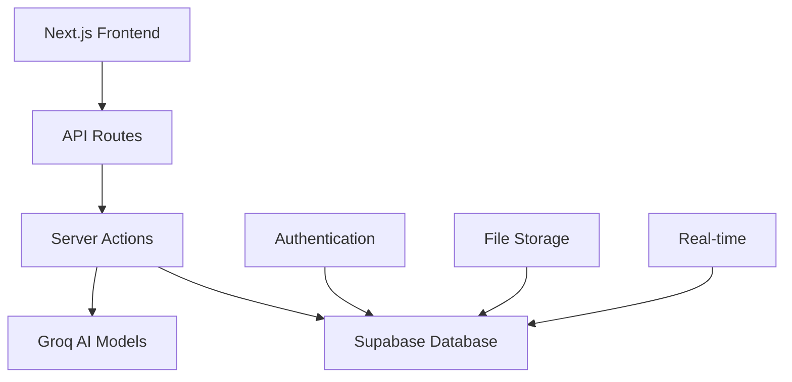
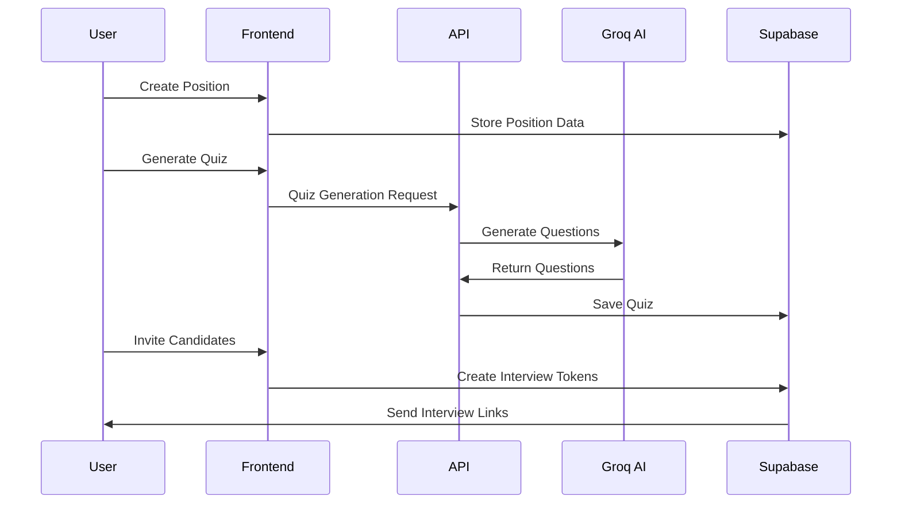
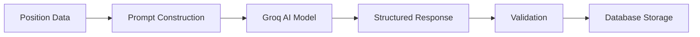

# DevRecruit AI

[](https://nextjs.org/)
[](https://reactjs.org/)
[](https://www.typescriptlang.org/)
[](https://supabase.com/)
[](https://tailwindcss.com/)

An advanced AI-powered technical recruitment platform that streamlines the hiring process through intelligent quiz generation, candidate assessment, and interview management.

## 📋 Table of Contents

- [🎯 Features](#-features)
- [🏗️ Architecture](#️-architecture)
- [🚀 Quick Start](#-quick-start)
- [📊 Database Schema](#-database-schema)
- [🔧 Technology Stack](#-technology-stack)
- [📱 Application Structure](#-application-structure)
- [🤖 AI Integration](#-ai-integration)
- [🔒 Authentication & Security](#-authentication--security)
- [📊 Component System](#-component-system)
- [🎨 UI/UX Design System](#-uiux-design-system)
- [🛠️ Development](#-development)
- [📚 API Reference](#-api-reference)
- [🔍 Testing](#-testing)
- [🚀 Deployment](#-deployment)
- [🤝 Contributing](#-contributing)
- [📄 License](#-license)

## 🎯 Features

### Core Functionality

#### 🎯 Position Management

- **Create and manage job positions** with detailed requirements
- **Define skills, experience levels, and contract types**
- **Position-based quiz assignment** and candidate filtering
- **Comprehensive position analytics** and tracking

#### 👥 Candidate Management

- **Candidate registration** with detailed profiles
- **Resume upload and management**
- **Status tracking** (pending, in-progress, completed, hired, rejected)
- **Position-based candidate organization**
- **Advanced search and filtering** capabilities

#### 📝 AI-Powered Quiz Generation

- **Intelligent quiz creation** using Groq AI models
- **Multiple question types**:
  - Multiple choice questions with 4 options
  - Open-ended questions with sample answers
  - Code snippet challenges with bug fixing exercises
- **Difficulty scaling** (1-5 levels)
- **Customizable question count** and time limits
- **Position-specific content** generation
- **Previous question avoidance** for unique assessments

#### 🎤 Interview Management

- **Token-based secure interview access**
- **Real-time interview monitoring**
- **Automatic scoring and evaluation**
- **Interview status tracking**
- **Results analysis and reporting**

#### 📊 Analytics and Reporting

- **Candidate performance analytics**
- **Quiz effectiveness metrics**
- **Interview completion rates**
- **Position-based statistics**

### Advanced Features

#### 🔄 Real-time Updates

- **Live interview monitoring**
- **Real-time status updates**
- **Instant quiz generation feedback**

#### 🎨 Modern UI/UX

- **Glass morphism design** with Vision Pro aesthetics
- **Dark/Light theme support** with system preference detection
- **Responsive design** for all device types
- **Accessibility-first** component design

#### 🔒 Enterprise Security

- **Row Level Security (RLS)** policies
- **Token-based interview access**
- **User isolation** and data protection
- **Secure API endpoints**

## 🏗️ Architecture

### System Architecture



### Application Flow



## 🚀 Quick Start

### Prerequisites

- **Node.js** 18.0 or higher
- **pnpm** (recommended) or npm/yarn
- **Supabase account**
- **Groq API key** for AI features

### Installation

1. **Clone the repository**

   ```bash
   git clone https://github.com/yourusername/dev-recruit-ai.git
   cd dev-recruit-ai
   ```

2. **Install dependencies**

   ```bash
   pnpm install
   ```

3. **Environment Setup**
   Create a `.env.local` file:

   ```env
   # Supabase Configuration
   NEXT_PUBLIC_SUPABASE_URL=your_supabase_project_url
   NEXT_PUBLIC_SUPABASE_ANON_KEY=your_supabase_anon_key
   SUPABASE_SERVICE_ROLE_KEY=your_service_role_key

   # AI Configuration
   GROQ_API_KEY=your_groq_api_key

   # Next.js Configuration
   NEXTAUTH_URL=http://localhost:3000
   NEXTAUTH_SECRET=your_nextauth_secret
   ```

4. **Database Setup**

   ```bash
   # Run the database migrations in Supabase SQL Editor
   # Copy and execute the contents of schema.sql
   ```

5. **Start Development Server**
   ```bash
   pnpm dev
   ```

Visit [http://localhost:3000](http://localhost:3000) to access the application.

## 📊 Database Schema

### Core Tables

#### [`profiles`](schema.sql:5)

Extends Supabase auth.users with additional profile information.

```sql
CREATE TABLE profiles (
  id UUID PRIMARY KEY REFERENCES auth.users,
  name TEXT,
  full_name TEXT,
  user_name TEXT,
  avatar_url TEXT,
  created_at TIMESTAMPTZ DEFAULT NOW(),
  updated_at TIMESTAMPTZ DEFAULT NOW()
);
```

#### [`positions`](schema.sql:46)

Job position definitions with skills and requirements.

```sql
CREATE TABLE positions (
  id UUID PRIMARY KEY DEFAULT uuid_generate_v4(),
  title TEXT NOT NULL,
  description TEXT,
  experience_level TEXT NOT NULL,
  skills TEXT[] NOT NULL,
  soft_skills TEXT[],
  contract_type TEXT,
  created_by UUID REFERENCES profiles(id),
  created_at TIMESTAMPTZ DEFAULT NOW()
);
```

#### [`candidates`](schema.sql:58)

Candidate information linked to positions.

```sql
CREATE TABLE candidates (
  id UUID PRIMARY KEY DEFAULT uuid_generate_v4(),
  name TEXT NOT NULL,
  email TEXT NOT NULL,
  position_id UUID REFERENCES positions(id),
  status TEXT DEFAULT 'pending',
  resume_url TEXT,
  created_by UUID REFERENCES profiles(id),
  created_at TIMESTAMPTZ DEFAULT NOW()
);
```

#### [`quizzes`](schema.sql:69)

AI-generated technical assessments.

```sql
CREATE TABLE quizzes (
  id UUID PRIMARY KEY DEFAULT uuid_generate_v4(),
  title TEXT NOT NULL,
  position_id UUID REFERENCES positions(id),
  questions JSONB NOT NULL,
  time_limit INTEGER,
  created_by UUID REFERENCES profiles(id),
  created_at TIMESTAMPTZ DEFAULT NOW()
);
```

#### [`interviews`](schema.sql:79)

Interview sessions with candidate responses and scoring.

```sql
CREATE TABLE interviews (
  id UUID PRIMARY KEY DEFAULT uuid_generate_v4(),
  candidate_id UUID REFERENCES candidates(id),
  quiz_id UUID REFERENCES quizzes(id),
  status TEXT DEFAULT 'pending',
  started_at TIMESTAMPTZ,
  completed_at TIMESTAMPTZ,
  score FLOAT,
  answers JSONB,
  token TEXT UNIQUE,
  created_at TIMESTAMPTZ DEFAULT NOW()
);
```

### Security Policies

The application implements **Row Level Security (RLS)** to ensure data isolation:

- **User Isolation**: Users can only access their own data
- **Token Access**: Interviews accessible via secure tokens
- **Position-based Access**: Candidates grouped by position ownership

### Database Functions

#### [`generate_unique_token()`](schema.sql:266)

Generates cryptographically secure interview tokens.

#### [`get_candidates_for_quiz_assignment()`](schema.sql:333)

Returns assigned and unassigned candidates for quiz management.

#### [`search_interviews()`](schema.sql:431)

Advanced interview search with filtering capabilities.

## 🔧 Technology Stack

### Frontend Framework

- **[Next.js 15.3.2](https://nextjs.org/)** - React framework with App Router
- **[React 19.1.0](https://reactjs.org/)** - UI library with concurrent features
- **[TypeScript 5.8.3](https://www.typescriptlang.org/)** - Type-safe development

### Backend & Database

- **[Supabase](https://supabase.com/)** - PostgreSQL database with real-time features
- **[Supabase Auth](https://supabase.com/auth)** - Authentication and user management
- **[Supabase Storage](https://supabase.com/storage)** - File storage for resumes

### AI Integration

- **[Groq](https://groq.com/)** - High-performance AI inference
- **[Vercel AI SDK](https://sdk.vercel.ai/)** - AI integration framework
- **[Zod](https://zod.dev/)** - Schema validation for AI responses

### UI Framework

- **[Tailwind CSS 4.1.4](https://tailwindcss.com/)** - Utility-first CSS framework
- **[Radix UI](https://www.radix-ui.com/)** - Accessible component primitives
- **[Lucide React](https://lucide.dev/)** - Modern icon library
- **[next-themes](https://github.com/pacocoursey/next-themes)** - Theme management

### Code Quality

- **[ESLint](https://eslint.org/)** - Code linting and formatting
- **[React Hook Form](https://react-hook-form.com/)** - Form state management
- **[Zod](https://zod.dev/)** - Runtime type validation

### Development Tools

- **[Storybook](https://storybook.js.org/)** - Component documentation
- **[Monaco Editor](https://microsoft.github.io/monaco-editor/)** - Code editing
- **[Prism](https://prismjs.com/)** - Syntax highlighting

## 📱 Application Structure

### Directory Organization

```
dev-recruit-ai/
├── app/                          # Next.js App Router
│   ├── api/                      # API route handlers
│   │   └── quiz-edit/           # Quiz generation endpoints
│   ├── auth/                     # Authentication pages
│   ├── dashboard/               # Main application pages
│   │   ├── candidates/          # Candidate management
│   │   ├── interviews/          # Interview management
│   │   ├── positions/           # Position management
│   │   ├── profile/             # User profile
│   │   └── quizzes/            # Quiz management
│   └── interview/               # Public interview pages
├── components/                   # Reusable UI components
│   ├── auth/                    # Authentication components
│   ├── dashboard/               # Dashboard-specific components
│   ├── interview/               # Interview interface components
│   ├── quiz/                    # Quiz management components
│   └── ui/                      # Base UI components
├── lib/                         # Utility libraries
│   ├── actions/                 # Server actions
│   └── supabase/               # Database configuration
└── public/                      # Static assets
```

### Key Components

#### Dashboard Layout

[`app/dashboard/layout.tsx`](app/dashboard/layout.tsx:1) provides the main application shell:

```tsx
export default function DashboardLayout({ children }) {
  return (
    <SidebarProvider>
      <AppSidebar />
      <SidebarInset>
        <header>
          <SidebarTrigger />
          <Breadcrumbs />
          <ThemeToggle />
        </header>
        <div className="p-4">{children}</div>
      </SidebarInset>
    </SidebarProvider>
  );
}
```

#### App Sidebar

[`components/dashboard/app-sidebar.tsx`](components/dashboard/app-sidebar.tsx:25) defines navigation:

```tsx
const navigation = [
  { href: "/dashboard/positions", label: "Posizioni", icon: Briefcase },
  { href: "/dashboard/candidates", label: "Candidati", icon: Users },
  { href: "/dashboard/quizzes", label: "Quiz", icon: FileQuestion },
  { href: "/dashboard/interviews", label: "Colloqui", icon: MessageSquareMore },
];
```

## 🤖 AI Integration

### Quiz Generation System

The AI system uses **Groq's high-performance inference** to generate technical assessments.

#### Generation Flow



#### Core Generation Function

[`lib/actions/quizzes.ts:generateNewQuizAction`](lib/actions/quizzes.ts:94)

```typescript
export async function generateNewQuizAction({
  positionId,
  quizTitle,
  questionCount,
  difficulty,
  includeMultipleChoice,
  includeOpenQuestions,
  includeCodeSnippets,
  instructions,
  previousQuestions,
  specificModel,
}) {
  // Get position details
  const { data: position } = await supabase
    .from("positions")
    .select("*")
    .eq("id", positionId)
    .single();

  // Construct AI prompt
  const prompt = `
    Genera un quiz tecnico per una posizione di "${position.title}" 
    con livello "${position.experience_level}".
    Competenze richieste: ${position.skills.join(", ")}
    // ... detailed prompt construction
  `;

  // Generate using Groq AI
  const result = await generateObject({
    model: groq(getOptimalModel("quiz_generation", specificModel)),
    prompt,
    schema: quizDataSchema,
  });

  return result.object;
}
```

### AI Model Selection

[`lib/utils.ts:getOptimalModel`](lib/utils.ts:1) optimizes model selection based on task type:

```typescript
export function getOptimalModel(taskType: string, specificModel?: string) {
  if (specificModel) return specificModel;

  switch (taskType) {
    case "quiz_generation":
      return "llama-3.3-70b-versatile"; // High reasoning capability
    case "question_generation":
      return "llama-3.1-8b-instant"; // Fast single questions
    default:
      return "llama-3.3-70b-versatile";
  }
}
```

### Question Types

#### Multiple Choice Questions

```typescript
{
  id: "q1",
  type: "multiple_choice",
  question: "Qual è la differenza principale tra let e var?",
  options: [
    "Non c'è differenza",
    "let ha scope di blocco, var ha scope di funzione",
    "var è più veloce",
    "let è deprecato"
  ],
  correctAnswer: 1,
  explanation: "let introduce il block scope..."
}
```

#### Open Questions

```typescript
{
  id: "q2",
  type: "open_question",
  question: "Spiega il concetto di closure in JavaScript",
  keywords: ["closure", "scope", "funzione", "variabile"],
  sampleAnswer: "Una closure è una funzione che mantiene accesso...",
  explanation: "Le closure sono fondamentali per..."
}
```

#### Code Snippet Questions

```typescript
{
  id: "q3",
  type: "code_snippet",
  question: "Correggi il bug in questo codice JavaScript",
  codeSnippet: "function sum(a, b) {\n  return a + b\n  console.log('done');\n}",
  sampleSolution: "function sum(a, b) {\n  console.log('done');\n  return a + b;\n}",
  language: "javascript"
}
```

### API Endpoints

#### Quiz Generation

[`app/api/quiz-edit/generate-quiz/route.ts`](app/api/quiz-edit/generate-quiz/route.ts:22)

```typescript
export async function POST(req: Request) {
  const body = await req.json();
  const validationResult = generateQuizRequestSchema.safeParse(body);

  if (!validationResult.success) {
    return NextResponse.json({ error: "Invalid request" }, { status: 400 });
  }

  const aiQuiz = await generateNewQuizAction(validationResult.data);
  return NextResponse.json(aiQuiz);
}
```

#### Question Generation

[`app/api/quiz-edit/generate-question/route.ts`](app/api/quiz-edit/generate-question/route.ts:1)

Individual question generation for quiz editing and expansion.

## 🔒 Authentication & Security

### Supabase Authentication

The application uses **Supabase Auth** with multiple providers:

- **Email/Password** authentication
- **OAuth providers** (Google, GitHub)
- **Magic link** authentication
- **Password reset** functionality

### Security Implementation

#### Server-Side Authentication

[`lib/supabase/server.ts`](lib/supabase/server.ts:1) handles server-side auth:

```typescript
export async function createClient() {
  const cookieStore = await cookies();

  return createServerClient(
    process.env.NEXT_PUBLIC_SUPABASE_URL!,
    process.env.NEXT_PUBLIC_SUPABASE_ANON_KEY!,
    {
      cookies: {
        getAll() {
          return cookieStore.getAll();
        },
        setAll(cookiesToSet) {
          cookiesToSet.forEach(({ name, value, options }) => {
            cookieStore.set(name, value, options);
          });
        },
      },
    }
  );
}
```

#### Middleware Protection

[`middleware.ts`](middleware.ts:1) protects routes:

```typescript
export async function middleware(request: NextRequest) {
  const { supabase, response } = await updateSession(request);

  // Protected routes
  if (request.nextUrl.pathname.startsWith("/dashboard")) {
    const {
      data: { user },
    } = await supabase.auth.getUser();

    if (!user) {
      return NextResponse.redirect(new URL("/auth/login", request.url));
    }
  }

  return response;
}
```

#### Row Level Security Policies

**Profiles Policy:**

```sql
CREATE POLICY "Users can only access their own profile"
ON profiles FOR ALL
USING (auth.uid() = id);
```

**Positions Policy:**

```sql
CREATE POLICY "Users can manage their own positions"
ON positions FOR ALL
USING (auth.uid() = created_by);
```

**Interview Token Access:**

```sql
CREATE POLICY "Anyone can access interviews by token"
ON interviews FOR SELECT
USING (token IS NOT NULL);
```

### Data Protection

- **User Isolation**: Each user only accesses their own data
- **Token Security**: Interview tokens are cryptographically secure
- **API Validation**: All inputs validated with Zod schemas
- **CSRF Protection**: Built-in Next.js CSRF protection

## 📊 Component System

### UI Component Architecture

The application uses a **component-driven architecture** with **Radix UI primitives**:

```
components/
├── ui/              # Base components (buttons, inputs, etc.)
├── auth/            # Authentication-specific components
├── dashboard/       # Dashboard layout components
├── interview/       # Interview interface components
├── quiz/           # Quiz management components
└── candidates/     # Candidate management components
```

### Base UI Components

#### Button Component

[`components/ui/button.tsx`](components/ui/button.tsx:1)

```typescript
const buttonVariants = cva(
  "inline-flex items-center justify-center rounded-md text-sm font-medium",
  {
    variants: {
      variant: {
        default: "bg-primary text-primary-foreground hover:bg-primary/90",
        destructive: "bg-destructive text-destructive-foreground",
        outline: "border border-input bg-background",
        secondary: "bg-secondary text-secondary-foreground",
        ghost: "hover:bg-accent hover:text-accent-foreground",
        link: "text-primary underline-offset-4 hover:underline",
      },
      size: {
        default: "h-10 px-4 py-2",
        sm: "h-9 rounded-md px-3",
        lg: "h-11 rounded-md px-8",
        icon: "h-10 w-10",
      },
    },
  }
);
```

### Quiz Components

#### Question Type Forms

[`components/quiz/question-types/`](components/quiz/question-types/)

**Multiple Choice Form:**
[`components/quiz/question-types/multiple-choice-form.tsx`](components/quiz/question-types/multiple-choice-form.tsx:1)

**Open Question Form:**
[`components/quiz/question-types/open-question-form.tsx`](components/quiz/question-types/open-question-form.tsx:1)

**Code Snippet Form:**
[`components/quiz/question-types/code-snippet-form.tsx`](components/quiz/question-types/code-snippet-form.tsx:1)

#### Question Display Components

[`components/quiz/question-display/`](components/quiz/question-display/)

These components handle rendering different question types during interviews.

### Form Management

**React Hook Form Integration:**

```typescript
const form = useForm<QuizFormData>({
  resolver: zodResolver(quizFormSchema),
  defaultValues: {
    title: "",
    questions: [],
    timeLimit: null,
  },
});
```

**Zod Validation Schemas:**
[`lib/actions/quiz-schemas.ts`](lib/actions/quiz-schemas.ts:1)

```typescript
export const questionSchema = z.discriminatedUnion("type", [
  z.object({
    id: z.string(),
    type: z.literal("multiple_choice"),
    question: z.string(),
    options: z.array(z.string()).min(4).max(4),
    correctAnswer: z.number().min(0).max(3),
    keywords: z.array(z.string()).optional(),
    explanation: z.string().optional(),
  }),
  // ... other question types
]);
```

## 🎨 UI/UX Design System

### Vision Pro-Inspired Design

The application features a **glass morphism design** inspired by Apple's Vision Pro interface:

#### Design Tokens

[`app/globals.css`](app/globals.css:1)

```css
:root {
  --glass-bg: rgba(255, 255, 255, 0.08);
  --glass-border: rgba(255, 255, 255, 0.12);
  --glass-shadow: 0 8px 32px rgba(0, 0, 0, 0.12);
  --backdrop-blur: blur(20px);
}

.glass-card {
  background: var(--glass-bg);
  backdrop-filter: var(--backdrop-blur) saturate(1.8);
  border: 1px solid var(--glass-border);
  box-shadow: var(--glass-shadow);
}
```

#### Animation System

**Smooth transitions** with custom easing:

```css
.transition-vision {
  transition: all 0.3s cubic-bezier(0.4, 0, 0.2, 1);
}

.ease-vision {
  transition-timing-function: cubic-bezier(0.25, 0.46, 0.45, 0.94);
}
```

### Theme System

**Dual Theme Support:**
[`components/theme-provider.tsx`](components/theme-provider.tsx:1)

```typescript
export function ThemeProvider({ children, ...props }) {
  return <NextThemesProvider {...props}>{children}</NextThemesProvider>;
}
```

**Dynamic Theme Colors:**

```css
.light {
  --background: oklch(0.98 0.005 210);
  --foreground: oklch(0.15 0.015 240);
  --primary: oklch(0.45 0.25 260);
}

.dark {
  --background: oklch(0.12 0.015 240);
  --foreground: oklch(0.9 0.01 240);
  --primary: oklch(0.65 0.25 260);
}
```

### Responsive Design

**Mobile-First Approach:**

```typescript
const breakpoints = {
  sm: "640px",
  md: "768px",
  lg: "1024px",
  xl: "1280px",
  "2xl": "1536px",
};
```

**Adaptive Layouts:**

- **Sidebar collapse** on mobile devices
- **Responsive tables** with horizontal scroll
- **Touch-friendly** button sizes
- **Adaptive typography** scaling

## 🛠️ Development

### Development Workflow

1. **Start Development Server**

   ```bash
   pnpm dev
   ```

2. **Build Application**

   ```bash
   pnpm build
   ```

3. **Run Linting**

   ```bash
   pnpm lint
   ```

4. **Start Storybook**
   ```bash
   pnpm storybook
   ```

### Component Development

**Storybook Integration:**
[`stories/`](stories/) directory contains component stories:

```typescript
// Button.stories.tsx
export default {
  title: "UI/Button",
  component: Button,
  parameters: {
    layout: "centered",
  },
} satisfies Meta<typeof Button>;

export const Default: Story = {
  args: {
    children: "Button",
  },
};
```

### Code Quality

**ESLint Configuration:**
[`eslint.config.mjs`](eslint.config.mjs:1)

```javascript
export default [
  {
    rules: {
      "@next/next/no-html-link-for-pages": "off",
      "react/jsx-key": "off",
    },
  },
];
```

**TypeScript Configuration:**
[`tsconfig.json`](tsconfig.json:1)

```json
{
  "compilerOptions": {
    "strict": true,
    "noUncheckedIndexedAccess": true,
    "allowJs": true,
    "skipLibCheck": true,
    "paths": {
      "@/*": ["./*"]
    }
  }
}
```

### Performance Optimization

**Next.js Configuration:**
[`next.config.mjs`](next.config.mjs:1)

```javascript
/** @type {import('next').NextConfig} */
const nextConfig = {
  experimental: {
    optimizePackageImports: ["@radix-ui/react-icons"],
  },
  images: {
    domains: ["supabase.co"],
  },
};
```

## 📚 API Reference

### Server Actions

#### Quiz Management

[`lib/actions/quizzes.ts`](lib/actions/quizzes.ts:1)

**generateAndSaveQuiz(formData: FormData)**

- Generates and saves a complete quiz
- **Parameters**: FormData with quiz configuration
- **Returns**: Quiz ID
- **Usage**: Form submission handling

**generateNewQuizAction(params: GenerateNewQuizActionParams)**

- AI-powered quiz generation
- **Parameters**: Quiz generation parameters
- **Returns**: Generated quiz data
- **Usage**: API endpoint integration

**generateNewQuestionAction(params: GenerateNewQuestionActionParams)**

- Generates individual questions
- **Parameters**: Question generation parameters
- **Returns**: Generated question object
- **Usage**: Quiz editing and expansion

#### Candidate Management

[`lib/actions/candidates.ts`](lib/actions/candidates.ts:1)

**createCandidate(formData: FormData)**

- Creates new candidate record
- **Parameters**: Candidate information
- **Returns**: Candidate ID
- **Usage**: Candidate registration

**updateCandidateStatus(candidateId: string, status: string)**

- Updates candidate status
- **Parameters**: Candidate ID and new status
- **Returns**: Updated candidate data
- **Usage**: Status management

### Database Functions

#### Interview Search

[`schema.sql:search_interviews`](schema.sql:431)

```sql
SELECT * FROM search_interviews(
  p_user_id := 'user-uuid',
  p_search := 'john',
  p_status := 'completed',
  p_position_id := 'position-uuid',
  p_programming_language := 'javascript',
  p_page := 1,
  p_limit := 10
);
```

#### Quiz Assignment Data

[`schema.sql:get_candidates_for_quiz_assignment`](schema.sql:333)

```sql
SELECT * FROM get_candidates_for_quiz_assignment(
  quiz_id_param := 'quiz-uuid',
  p_user_id := 'user-uuid'
);
```

### REST API Endpoints

#### POST `/api/quiz-edit/generate-quiz`

Generates a complete quiz using AI.

**Request Body:**

```typescript
{
  positionId: string;
  quizTitle: string;
  questionCount: number;
  difficulty: number;
  includeMultipleChoice: boolean;
  includeOpenQuestions: boolean;
  includeCodeSnippets: boolean;
  specificModel?: string;
  instructions?: string;
  previousQuestions?: Array<{ question: string }>;
}
```

**Response:**

```typescript
{
  questions: Array<Question>;
}
```

#### POST `/api/quiz-edit/generate-question`

Generates a single question.

**Request Body:**

```typescript
{
  quizTitle: string;
  positionTitle: string;
  experienceLevel: string;
  skills: string[];
  type: "multiple_choice" | "open_question" | "code_snippet";
  previousQuestions?: Array<{ question: string; type?: string }>;
  specificModel?: string;
  instructions?: string;
}
```

**Response:**

```typescript
Question; // Single question object
```

#### POST `/api/quiz-edit/update`

Updates an existing quiz.

**Request Body:**

```typescript
{
  quizId: string;
  title: string;
  timeLimit?: number;
  questions: Array<Question>;
}
```

## 🔍 Testing

### Component Testing

**Storybook Stories:**
Component stories serve as living documentation and testing:

```typescript
export const ButtonVariants: Story = {
  render: () => (
    <div className="flex gap-4">
      <Button variant="default">Default</Button>
      <Button variant="secondary">Secondary</Button>
      <Button variant="destructive">Destructive</Button>
      <Button variant="outline">Outline</Button>
      <Button variant="ghost">Ghost</Button>
      <Button variant="link">Link</Button>
    </div>
  ),
};
```

### API Testing

**Server Action Testing:**

```typescript
// Test quiz generation
const quizData = await generateNewQuizAction({
  positionId: "test-position-id",
  quizTitle: "Test Quiz",
  questionCount: 5,
  difficulty: 3,
  includeMultipleChoice: true,
  includeOpenQuestions: true,
  includeCodeSnippets: false,
});

expect(quizData.questions).toHaveLength(5);
```

### Database Testing

**Supabase Testing:**

```sql
-- Test RLS policies
SET ROLE authenticated;
SET request.jwt.claims TO '{"sub": "user-uuid"}';

-- Should return only user's data
SELECT * FROM positions;
```

### End-to-End Testing

**User Flow Testing:**

1. **User Registration** → Profile Creation
2. **Position Creation** → Skills Assignment
3. **Quiz Generation** → AI Integration
4. **Candidate Invitation** → Token Generation
5. **Interview Completion** → Score Calculation

## 🚀 Deployment

### Vercel Deployment (Recommended)

1. **Connect Repository**

   ```bash
   vercel --prod
   ```

2. **Environment Variables**
   Set in Vercel dashboard:

   ```env
   NEXT_PUBLIC_SUPABASE_URL
   NEXT_PUBLIC_SUPABASE_ANON_KEY
   SUPABASE_SERVICE_ROLE_KEY
   GROQ_API_KEY
   ```

3. **Domain Configuration**
   Update Supabase authentication settings with your domain.

### Docker Deployment

**Dockerfile:**

```dockerfile
FROM node:18-alpine AS dependencies
WORKDIR /app
COPY package.json pnpm-lock.yaml ./
RUN npm install -g pnpm && pnpm install --frozen-lockfile

FROM node:18-alpine AS builder
WORKDIR /app
COPY . .
COPY --from=dependencies /app/node_modules ./node_modules
RUN npm run build

FROM node:18-alpine AS runner
WORKDIR /app
ENV NODE_ENV production
COPY --from=builder /app/public ./public
COPY --from=builder /app/.next ./.next
COPY --from=builder /app/node_modules ./node_modules
COPY --from=builder /app/package.json ./package.json

EXPOSE 3000
CMD ["npm", "start"]
```

### Database Migration

**Production Setup:**

1. Create Supabase project
2. Run [`schema.sql`](schema.sql:1) in SQL Editor
3. Configure authentication providers
4. Set up storage buckets for resumes
5. Configure RLS policies

### Environment Configuration

**Production Environment:**

```env
# Database
NEXT_PUBLIC_SUPABASE_URL=https://your-project.supabase.co
NEXT_PUBLIC_SUPABASE_ANON_KEY=your-anon-key
SUPABASE_SERVICE_ROLE_KEY=your-service-role-key

# AI
GROQ_API_KEY=your-groq-api-key

# Application
NEXTAUTH_URL=https://your-domain.com
NEXTAUTH_SECRET=your-production-secret
```

### Performance Optimization

**Build Optimization:**

```bash
# Analyze bundle size
npm run build && npm run analyze

# Performance profiling
npm run dev -- --turbo
```

**Caching Strategy:**

- **Static assets**: CDN caching
- **API responses**: Server-side caching
- **Database queries**: Supabase edge caching

## 🤝 Contributing

### Development Setup

1. **Fork the repository**
2. **Create feature branch**

   ```bash
   git checkout -b feature/your-feature-name
   ```

3. **Install dependencies**

   ```bash
   pnpm install
   ```

4. **Start development server**
   ```bash
   pnpm dev
   ```

### Contribution Guidelines

#### Code Style

- **TypeScript**: Strict mode enabled
- **ESLint**: Follow configured rules
- **Prettier**: Automatic formatting
- **Naming**: Descriptive, camelCase for variables, PascalCase for components

#### Component Development

```typescript
// Component template
interface ComponentProps {
  // Props interface
}

export function Component({ ...props }: ComponentProps) {
  // Implementation
  return <div>Component content</div>;
}

// Export with proper typing
export type { ComponentProps };
```

#### Database Changes

1. **Schema modifications**: Update [`schema.sql`](schema.sql:1)
2. **Migration scripts**: Provide upgrade path
3. **RLS policies**: Maintain security
4. **Function updates**: Document parameters

#### Testing Requirements

- **Component stories**: Add Storybook stories
- **API testing**: Test server actions
- **Type safety**: Ensure TypeScript compliance
- **Security**: Validate RLS policies

### Pull Request Process

1. **Description**: Clear feature description
2. **Testing**: Include test results
3. **Documentation**: Update relevant docs
4. **Screenshots**: For UI changes
5. **Performance**: No significant degradation

### Issue Reporting

**Bug Reports:**

- **Environment**: OS, browser, Node.js version
- **Steps**: Reproduction steps
- **Expected**: Expected behavior
- **Actual**: Actual behavior
- **Screenshots**: If applicable

**Feature Requests:**

- **Problem**: What problem does this solve?
- **Solution**: Proposed solution
- **Alternatives**: Considered alternatives
- **Impact**: Who benefits from this feature?

## 📄 License

This project is licensed under the **MIT License** - see the [LICENSE.md](LICENSE.md) file for details.

### MIT License Summary

- ✅ **Commercial use**
- ✅ **Modification**
- ✅ **Distribution**
- ✅ **Private use**
- ❌ **Liability**
- ❌ **Warranty**

---

## 🔗 Links

- **Documentation**: [GitHub Wiki](https://github.com/yourusername/dev-recruit-ai/wiki)
- **Issues**: [GitHub Issues](https://github.com/yourusername/dev-recruit-ai/issues)
- **Discussions**: [GitHub Discussions](https://github.com/yourusername/dev-recruit-ai/discussions)
- **Supabase**: [https://supabase.com/](https://supabase.com/)
- **Groq**: [https://groq.com/](https://groq.com/)
- **Next.js**: [https://nextjs.org/](https://nextjs.org/)
- **Tailwind CSS**: [https://tailwindcss.com/](https://tailwindcss.com/)

---

**DevRecruit AI** - Transforming technical recruitment with the power of artificial intelligence.

_For support, please create an issue or contact the development team._
