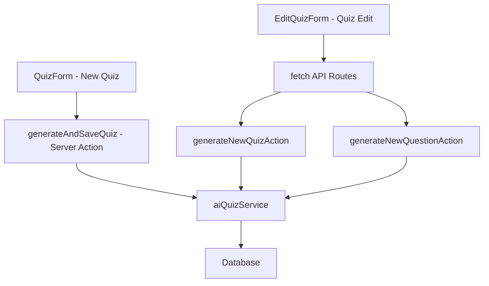

# 🏗️ Architecture Consolidation Plan - DevRecruit AI Quiz Generation

## 📊 Current State Analysis

### **Issues Identified:**

1. **❌ Inconsistent API Patterns**: Mixed approaches between direct server actions and API routes
2. **❌ Duplicated Zod Schemas**: Multiple validation schemas for similar data across files
3. **❌ Redundant Code Paths**: Two different ways to call the same AI generation functionality
4. **❌ Maintenance Overhead**: Changes require updates in multiple places

### **Current Data Flow:**



## 🎯 Recommended Solution: Standardize on API Routes

### **Why API Routes Over Server Actions for AI Generation:**

#### ✅ **Advantages of API Routes:**

- **Better Rate Limiting**: Built-in request throttling and abuse prevention
- **Enhanced Monitoring**: Performance metrics, request logging, error tracking
- **Consistent Error Handling**: HTTP status codes and structured error responses
- **Request Validation**: Size limits, content-type validation, security headers
- **Easier Testing**: Standard HTTP testing tools and frameworks
- **Better Debugging**: Network tab visibility, request/response inspection
- **Scalability**: Can be easily moved to separate services or edge functions

#### ❌ **Server Actions Limitations for AI Generation:**

- Limited error handling options
- No built-in rate limiting
- Harder to monitor and debug
- Less flexible for complex validation
- Form-data constraints

### **Recommended Architecture:**

```mermaid
graph TD
    A[All Components] --> B[Standardized API Routes]
    B --> C[Enhanced Route Handlers]
    C --> D[Consolidated Business Logic]
    D --> E[aiQuizService]
    E --> F[Database]

    subgraph "API Routes"
        G[/api/quiz/generate]
        H[/api/quiz/regenerate]
        I[/api/quiz/generate-question]
    end
```

## 📋 Schema Consolidation Plan

### **Current Schema Duplication:**

| File                                           | Schema Name                     | Purpose                  | Lines |
| ---------------------------------------------- | ------------------------------- | ------------------------ | ----- |
| `QuizForm.tsx`                                 | `formSchema`                    | Frontend validation      | 29-42 |
| `lib/actions/quizzes.ts`                       | `generateQuizFormSchema`        | Server action validation | 16-42 |
| `app/api/quiz-edit/generate-quiz/route.ts`     | `generateQuizRequestSchema`     | API route validation     | 9-37  |
| `app/api/quiz-edit/generate-question/route.ts` | `generateQuestionRequestSchema` | API route validation     | 9-31  |

### **Proposed Consolidated Schema Structure:**

```typescript
// lib/schemas/quiz-generation.ts
import { z } from "zod";

// Base schemas for reuse
export const difficultySchema = z.number().int().min(1).max(5);
export const questionCountSchema = z.number().int().min(1).max(50);
export const instructionsSchema = z.string().max(2000).optional();
export const questionTypeSchema = z.enum([
  "multiple_choice",
  "open_question",
  "code_snippet",
]);

// Core quiz generation schema
export const quizGenerationBaseSchema = z.object({
  quizTitle: z.string().min(1).max(200),
  difficulty: difficultySchema,
  instructions: instructionsSchema,
  includeMultipleChoice: z.boolean(),
  includeOpenQuestions: z.boolean(),
  includeCodeSnippets: z.boolean(),
});

// Frontend form schema (for client-side validation)
export const quizFormSchema = quizGenerationBaseSchema.extend({
  questionCount: questionCountSchema,
  enableTimeLimit: z.boolean(),
  timeLimit: z.number().min(5).max(120).optional(),
  llmModel: z.string(),
});

// API request schemas
export const generateQuizRequestSchema = quizGenerationBaseSchema.extend({
  positionId: z.string().uuid(),
  questionCount: questionCountSchema,
  previousQuestions: z
    .array(
      z.object({
        question: z.string().min(1),
      })
    )
    .optional(),
  specificModel: z.string().optional(),
});

export const generateQuestionRequestSchema = z.object({
  quizTitle: z.string().min(1).max(200),
  positionTitle: z.string().min(1).max(200),
  experienceLevel: z.string().min(1),
  skills: z.array(z.string()).min(1),
  type: questionTypeSchema,
  difficulty: difficultySchema.optional(),
  previousQuestions: z
    .array(
      z.object({
        question: z.string().min(1),
        type: z.string().optional(),
      })
    )
    .optional(),
  specificModel: z.string().optional(),
  instructions: instructionsSchema,
});
```

## 🚀 Implementation Plan

### **Phase 1: Schema Consolidation**

1. **Create centralized schemas** (`lib/schemas/quiz-generation.ts`)
2. **Update all files** to import from centralized location
3. **Remove duplicate schema definitions**
4. **Ensure type consistency** across the application

### **Phase 2: API Route Standardization**

1. **Enhance existing API routes** with better validation and error handling
2. **Update QuizForm** to use API routes instead of server actions
3. **Consolidate route handlers** for consistent behavior
4. **Add comprehensive request/response typing**

### **Phase 3: Business Logic Cleanup**

1. **Remove redundant server actions** (keep only database operations)
2. **Consolidate AI generation logic** in route handlers
3. **Improve error handling** with standardized responses
4. **Add comprehensive logging** and monitoring

## 📁 Proposed File Structure

```
lib/
├── schemas/
│   ├── quiz-generation.ts    # Consolidated validation schemas
│   └── quiz-data.ts          # Existing quiz data schemas
├── services/
│   ├── ai-service.ts         # AI generation service (existing)
│   └── quiz-service.ts       # Business logic consolidation
├── actions/
│   ├── quiz-crud.ts          # Database CRUD operations only
│   └── quiz-schemas.ts       # Keep for backward compatibility
└── utils/
    └── error-response.ts     # Standardized error handling

app/api/quiz/
├── generate/route.ts         # Primary quiz generation
├── regenerate/route.ts       # Quiz regeneration
└── generate-question/route.ts # Individual question generation
```

## 🔄 Migration Steps

### **Step 1: Create Consolidated Schemas**

```typescript
// Create lib/schemas/quiz-generation.ts with all schemas
// Export types for TypeScript usage
```

### **Step 2: Update Imports**

```typescript
// Replace all local schema definitions with imports
import {
  quizFormSchema,
  generateQuizRequestSchema,
} from "@/lib/schemas/quiz-generation";
```

### **Step 3: Standardize API Calls**

```typescript
// Update QuizForm.tsx to use API routes
const response = await fetch("/api/quiz/generate", {
  method: "POST",
  headers: { "Content-Type": "application/json" },
  body: JSON.stringify(validatedData),
});
```

### **Step 4: Enhanced Route Handlers**

```typescript
// Improve error handling, validation, and response formatting
// Add request size limits, rate limiting, and monitoring
```

## 📈 Benefits of Consolidation

### **Immediate Benefits:**

- ✅ **Reduced Code Duplication**: Single source of truth for validation
- ✅ **Consistent Error Handling**: Standardized across all endpoints
- ✅ **Better Type Safety**: Shared types prevent inconsistencies
- ✅ **Easier Maintenance**: Changes in one place update everywhere

### **Long-term Benefits:**

- ✅ **Better Monitoring**: Centralized performance tracking
- ✅ **Enhanced Security**: Consistent validation and rate limiting
- ✅ **Improved Testing**: Standard HTTP testing approaches
- ✅ **Scalability**: Easy to extract to microservices later

## 🎯 Recommended Implementation Order

### **Priority 1: Critical (Week 1)**

1. Create consolidated schema file
2. Update all imports to use centralized schemas
3. Test existing functionality to ensure no regressions

### **Priority 2: Important (Week 2)**

1. Update QuizForm to use API routes
2. Remove redundant server action calls
3. Enhance error handling in API routes

### **Priority 3: Nice to Have (Week 3+)**

1. Add comprehensive monitoring and logging
2. Implement advanced rate limiting
3. Add request/response validation middleware

## 🧪 Testing Strategy

### **Unit Tests:**

- Schema validation with various input combinations
- Error handling for edge cases
- Type safety verification

### **Integration Tests:**

- End-to-end API route testing
- Form submission workflows
- Error state handling

### **Performance Tests:**

- Rate limiting behavior
- Large request handling
- Concurrent request processing

## 🎉 Success Metrics

- **Code Reduction**: 30% reduction in validation-related code
- **Consistency**: 100% schema consistency across components
- **Performance**: Improved API response times with better caching
- **Maintainability**: Single point of change for validation logic
- **Developer Experience**: Improved TypeScript IntelliSense and error messages

---

**Recommendation: Implement this consolidation plan to achieve a more maintainable, consistent, and scalable architecture for the DevRecruit AI quiz generation system.**
