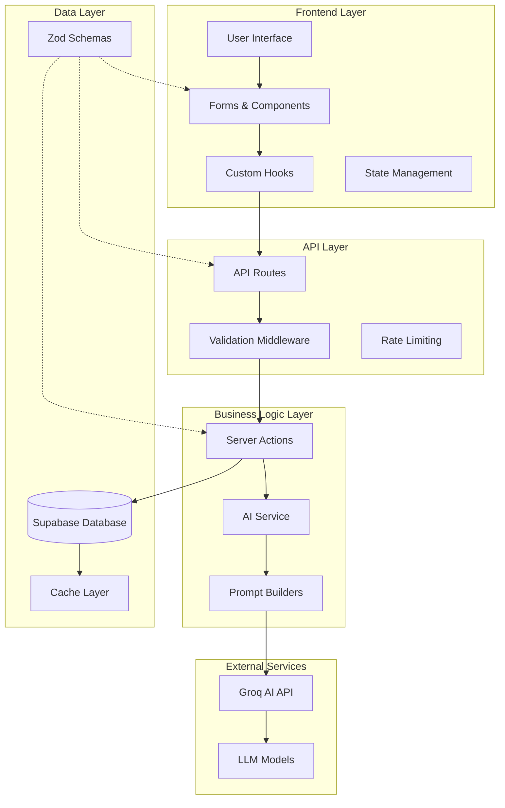
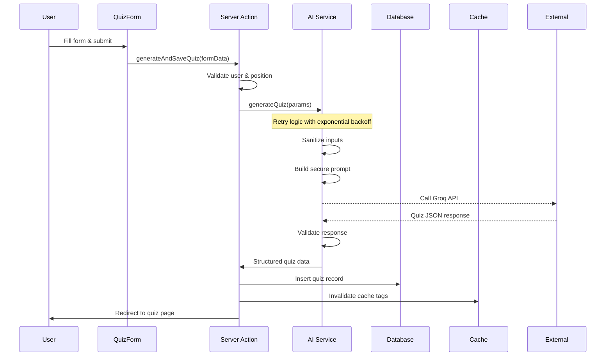
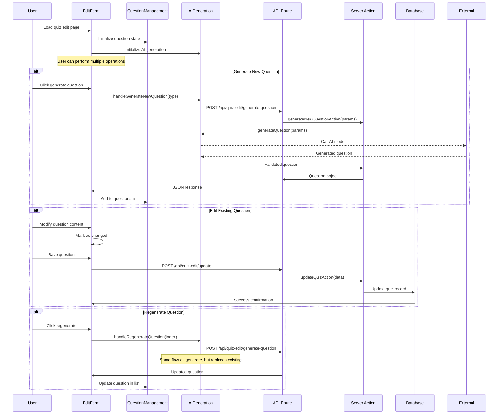
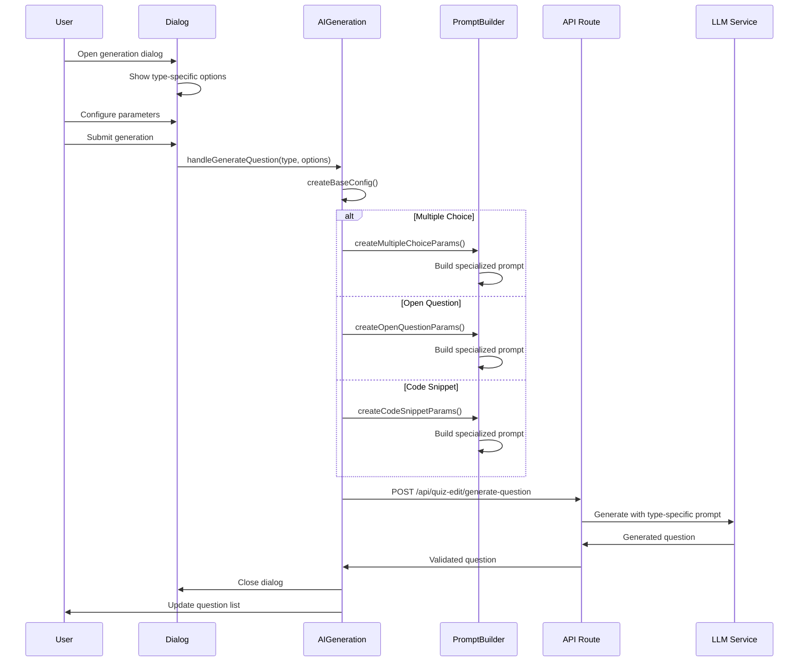
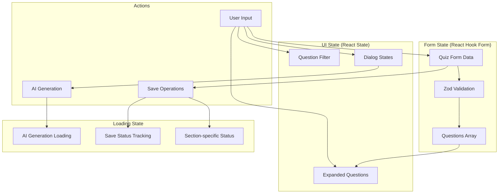

# Quiz Generation and Editing Flow Documentation

## 📋 Overview

This document provides a comprehensive guide to understanding the quiz generation and editing flow in the DevRecruit AI application. It covers the entire lifecycle from creating new quizzes to editing individual questions, including all the architectural components and their interactions.

## 🏗️ System Architecture Overview

The quiz system is built on a modern React/Next.js architecture with clear separation of concerns:



## 🎯 Core Actors and Components

### 1. Frontend Components

#### Main Quiz Form (`app/dashboard/positions/[id]/quiz/new/QuizForm.tsx`)

- **Purpose**: Initial quiz creation interface for new quizzes
- **Responsibilities**:
  - Collect quiz metadata (title, difficulty, question types)
  - Position-specific configuration
  - AI model selection
  - Form validation and submission
- **Data Flow**: User Input → Form Validation → Server Action → Database

#### Edit Quiz Form (`app/dashboard/quizzes/[id]/edit/components/edit-quiz-form.tsx`)

- **Purpose**: Main orchestrator for quiz editing functionality
- **Responsibilities**:
  - Coordinate between multiple hooks and components
  - Manage AI generation dialogs state
  - Handle preset generation workflows
  - Provide unified interface for all editing operations

#### Question Management Components

- **QuestionsHeader**: Controls for filtering, expanding/collapsing questions, and generating new questions
- **QuestionsList**: Renders the list of questions with filtering capabilities
- **QuestionItem**: Individual question editor with type-specific forms
- **PresetGenerationButtons**: Smart presets for common question patterns

### 2. Custom Hooks

#### useEditQuizForm (`hooks/use-edit-quiz-form.ts`)

- **Purpose**: Core form management for quiz editing
- **Key Features**:
  - React Hook Form integration with Zod validation
  - Section-specific save tracking (settings vs questions)
  - Optimistic updates and error handling
  - Question array manipulation (add, remove, update)

```typescript
const {
  form, // React Hook Form instance
  fields, // Question array from useFieldArray
  append, // Add new question
  prepend, // Add question at beginning
  remove, // Remove question by index
  update, // Update existing question
  handleSave, // Save entire quiz
  saveStatus, // Overall save status
  handleSaveQuestion, // Save individual question
  hasQuestionChanges, // Check if question has unsaved changes
  sectionSaveStatus, // Granular save status tracking
} = useEditQuizForm({ quiz, position });
```

#### useAIGeneration (`hooks/use-ai-generation.ts`)

- **Purpose**: Orchestrates AI-powered question generation
- **Key Features**:
  - Type-specific prompt building
  - Multiple generation methods (single, preset, full quiz)
  - Error handling and retry logic
  - Context-aware generation based on position skills

```typescript
const {
  aiLoading, // Loading state for AI operations
  generatingQuestionType, // Currently generating question type
  handleGenerateQuestion, // Generate single question with options
  handleRegenerateQuestion, // Regenerate existing question
  generateFrontendQuestion, // Frontend-optimized generation
  generateBackendQuestion, // Backend-optimized generation
  handleGenerateFullQuiz, // Replace entire quiz
} = useAIGeneration({
  form,
  fields,
  position,
  prepend,
  append,
  remove,
  update,
  setExpandedQuestions,
});
```

#### useQuestionManagement (`hooks/use-question-management.ts`)

- **Purpose**: Manages question UI state and filtering
- **Key Features**:
  - Question type filtering
  - Expansion/collapse state management
  - Memoized filtering for performance

### 3. API Routes

#### Generate Quiz (`/api/quiz-edit/generate-quiz`)

- **Method**: POST
- **Purpose**: Generate complete quiz with multiple questions
- **Rate Limiting**: 5 requests per minute
- **Features**: Input validation, error handling, model fallback

#### Generate Question (`/api/quiz-edit/generate-question`)

- **Method**: POST
- **Purpose**: Generate individual questions with type-specific parameters
- **Rate Limiting**: 10 requests per minute
- **Features**: Context awareness, type-specific prompts

#### Update Quiz (`/api/quiz-edit/update`)

- **Method**: POST
- **Purpose**: Save quiz modifications to database
- **Features**: Optimistic updates, cache invalidation

### 4. Server Actions

#### generateNewQuizAction (`lib/actions/quizzes.ts`)

- **Purpose**: Complete quiz creation workflow
- **Flow**: Parameters → AI Generation → Structured Response
- **Features**: User authentication, position validation, performance monitoring

#### generateNewQuestionAction (`lib/actions/quizzes.ts`)

- **Purpose**: Individual question generation
- **Flow**: Context → AI Service → Validated Question
- **Features**: Type-specific prompts, error handling

#### updateQuizAction (`lib/actions/quizzes.ts`)

- **Purpose**: Save quiz modifications
- **Flow**: Form Data → Validation → Database Update → Cache Invalidation

### 5. AI Service Layer

#### AIQuizService (`lib/services/ai-service.ts`)

- **Purpose**: Core AI generation orchestration
- **Key Features**:
  - Model selection and fallback
  - Retry mechanisms with exponential backoff
  - Input sanitization and prompt injection prevention
  - Performance monitoring and timeout handling

#### Prompt Builders

- **BasePromptBuilder**: Abstract base for all prompt builders
- **MultipleChoicePromptBuilder**: Specialized for multiple choice questions
- **OpenQuestionPromptBuilder**: Specialized for open-ended questions
- **CodeSnippetPromptBuilder**: Specialized for code debugging questions

## 🔄 Detailed Flow Diagrams

### 1. Quiz Creation Flow



### 2. Quiz Editing Flow



### 3. Question Generation Flow



### 4. State Management Flow



## 🎨 UI/UX Patterns

### Progressive Enhancement

- **Basic Form**: Standard form inputs for manual question creation
- **AI Assistance**: Optional AI generation with smart defaults
- **Advanced Options**: Detailed configuration for power users

### Real-time Feedback

- **Loading States**: Clear indicators during AI generation
- **Save Status**: Granular feedback for individual sections
- **Validation**: Immediate feedback on form errors

### Optimistic Updates

- **Question Addition**: Questions appear immediately during generation
- **State Preservation**: Form state maintained during navigation
- **Error Recovery**: Graceful handling of failed operations

## 🔧 Key Technical Patterns

### 1. Type-Safe Question Generation

```typescript
// Type-specific parameter building
switch (type) {
  case "multiple_choice":
    params = createMultipleChoiceParams(baseConfig, index, {
      focusAreas: options.focusAreas,
      distractorComplexity: options.distractorComplexity,
    });
    break;
  case "open_question":
    params = createOpenQuestionParams(baseConfig, index, {
      requireCodeExample: options.requireCodeExample,
      expectedResponseLength: options.expectedResponseLength,
    });
    break;
  case "code_snippet":
    params = createCodeSnippetParams(baseConfig, index, {
      language: options.language,
      bugType: options.bugType,
      codeComplexity: options.codeComplexity,
    });
    break;
}
```

### 2. Granular Save State Management

```typescript
// Section-specific save tracking
const [sectionSaveStatus, setSectionSaveStatus] = useState<{
  settings: SaveStatus;
  questions: Record<string, SaveStatus>;
}>({
  settings: "idle",
  questions: {},
});

// Individual question save
const handleSaveQuestion = async (index: number, data: EditQuizFormData) => {
  const questionId = fields[index]?.id;
  setSectionSaveStatus((prev) => ({
    ...prev,
    questions: { ...prev.questions, [questionId]: "saving" },
  }));
  // ... save logic
};
```

### 3. Context-Aware Generation

```typescript
// Base configuration from form and position
const createBaseConfig = () => ({
  quizTitle: form.getValues("title"),
  positionTitle: position.title,
  experienceLevel: position.experience_level,
  skills: position.skills,
  previousQuestions: fields.map((field) => ({
    question: field.question,
    type: field.type,
  })),
});
```

### 4. Error Boundary and Recovery

```typescript
// Comprehensive error handling with fallbacks
try {
  const response = await fetch("/api/quiz-edit/generate-question", {
    method: "POST",
    headers: { "Content-Type": "application/json" },
    body: JSON.stringify(params),
  });

  if (!response.ok) {
    const errorData = await response.json();
    throw new Error(errorData.error || `HTTP ${response.status}`);
  }

  // Success handling
} catch (error) {
  // Detailed error logging and user feedback
  console.error("Generation error:", error);
  toast.error("Generation failed", {
    description: error.message,
  });
}
```

## 📊 Performance Considerations

### 1. Optimistic Updates

- Questions appear immediately in the UI
- Background validation and persistence
- Rollback on failure with user notification

### 2. Memoization and Optimization

- `useMemo` for filtered question lists
- `useCallback` for stable function references
- Debounced save operations for form changes

### 3. Code Splitting

- Lazy loading of AI generation dialogs
- Dynamic imports for heavy components
- Progressive enhancement of features

### 4. Cache Management

- Automatic cache invalidation on updates
- Optimistic cache updates for better UX
- Background cache warming for common operations

## 🛡️ Security and Validation

### 1. Input Sanitization

```typescript
function sanitizeInput(input: string): string {
  const dangerous_patterns = [
    /ignore\s+previous\s+instructions/gi,
    /forget\s+everything\s+above/gi,
    /you\s+are\s+now/gi,
    // ... more patterns
  ];

  let sanitized = input;
  dangerous_patterns.forEach((pattern) => {
    sanitized = sanitized.replace(pattern, "[filtered]");
  });

  return sanitized.substring(0, 2000); // Length limit
}
```

### 2. Rate Limiting

- API route level rate limiting
- Per-user operation throttling
- Graceful degradation on limits

### 3. Authentication and Authorization

- User authentication for all operations
- Position ownership verification
- Role-based access control

## 🚀 Development Guidelines

### 1. Adding New Question Types

1. **Define Type in Schema**:

```typescript
// lib/schemas/question.ts
export const newQuestionTypeSchema = z.object({
  type: z.literal("new_type"),
  // ... type-specific fields
});
```

2. **Create Prompt Builder**:

```typescript
// lib/services/ai-service.ts
class NewTypePromptBuilder extends BasePromptBuilder {
  buildSystemPrompt(questionIndex?: number): string {
    // Type-specific system prompt
  }

  buildUserPrompt(params: NewTypeParams): string {
    // Type-specific user prompt
  }
}
```

3. **Add Form Component**:

```typescript
// components/quiz/question-types/new-type-form.tsx
export const NewTypeForm = ({ index }: { index: number }) => {
  // Type-specific form fields
};
```

4. **Update Generation Logic**:

```typescript
// hooks/use-ai-generation.ts
case "new_type":
  params = createNewTypeParams(baseConfig, index, options);
  break;
```

### 2. Best Practices

#### Component Organization

- **Single Responsibility**: Each component has a clear, focused purpose
- **Composition**: Build complex UIs from simple, reusable components
- **Props Interface**: Well-defined TypeScript interfaces for all props

#### State Management

- **Colocation**: Keep state close to where it's used
- **Lifting State**: Move state up only when needed by multiple components
- **Custom Hooks**: Extract complex state logic into reusable hooks

#### Error Handling

- **Error Boundaries**: Catch and handle component errors gracefully
- **User Feedback**: Provide clear, actionable error messages
- **Fallback UI**: Show alternative content when operations fail

#### Performance

- **Lazy Loading**: Load components and features on demand
- **Memoization**: Prevent unnecessary re-renders and computations
- **Bundle Optimization**: Keep bundle sizes small and performant

## 🔍 Troubleshooting Guide

### Common Issues

#### 1. AI Generation Failures

- **Symptoms**: Generation requests fail or return invalid responses
- **Causes**: Model unavailability, rate limiting, invalid prompts
- **Solutions**: Check model status, implement fallbacks, validate prompts

#### 2. Form State Issues

- **Symptoms**: Form values not updating, validation errors
- **Causes**: Schema mismatches, async state updates, form registration issues
- **Solutions**: Verify schemas, use proper form methods, check field registration

#### 3. Performance Problems

- **Symptoms**: Slow rendering, memory leaks, high CPU usage
- **Causes**: Large question lists, unnecessary re-renders, memory leaks
- **Solutions**: Implement virtualization, optimize re-renders, check for leaks

### Debugging Tools

#### 1. React Developer Tools

- Component state inspection
- Performance profiling
- Re-render tracking

#### 2. Network Tab

- API request/response analysis
- Rate limiting verification
- Error response debugging

#### 3. Console Logging

- Strategic logging for state changes
- Error boundary logging
- AI generation debugging

## 📚 Related Documentation

- [Quiz AI Generation System](./QUIZ_AI_GENERATION_SYSTEM.md) - Detailed AI service documentation
- [Enhanced AI Generation System](./ENHANCED_AI_GENERATION_SYSTEM.md) - Advanced AI features
- [Cache Implementation](./CACHE_IMPLEMENTATION.md) - Caching strategy and implementation
- [Schema Type Safety Improvements](./SCHEMA_TYPE_SAFETY_IMPROVEMENTS.md) - Type safety guidelines

## 🎯 Future Enhancements

### 1. Advanced AI Features

- **Multi-modal Questions**: Support for images, audio, video
- **Adaptive Difficulty**: Dynamic difficulty adjustment based on responses
- **Personalization**: Question generation based on candidate history

### 2. Collaboration Features

- **Real-time Editing**: Multiple users editing the same quiz
- **Comment System**: Collaborative review and feedback
- **Version History**: Track and restore quiz versions

### 3. Analytics and Insights

- **Generation Analytics**: Track AI generation success rates
- **Usage Patterns**: Understand how users create and edit quizzes
- **Performance Metrics**: Monitor system performance and optimization opportunities

This documentation serves as a comprehensive guide for developers working with the quiz generation and editing system. It provides the context and understanding needed to effectively contribute to and maintain this complex system.
